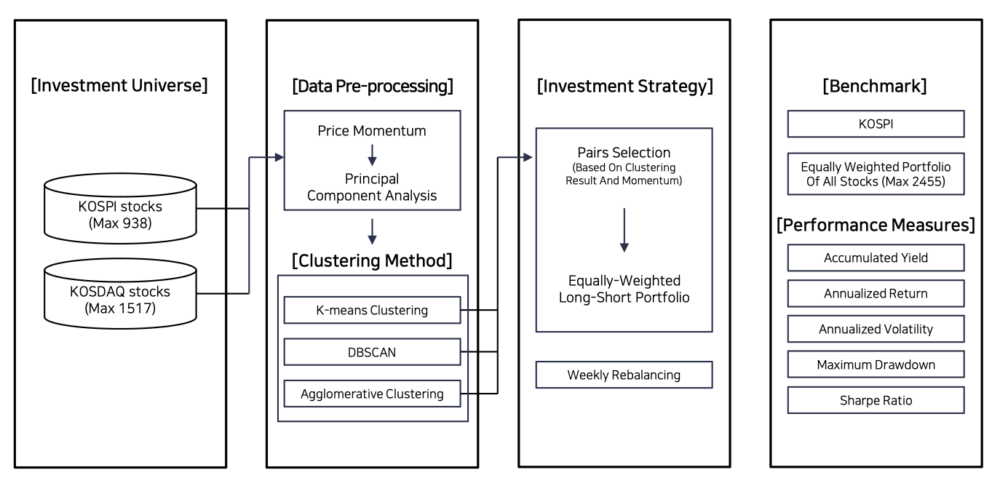
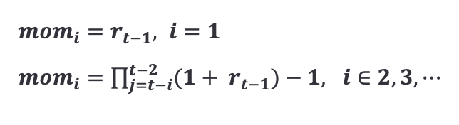
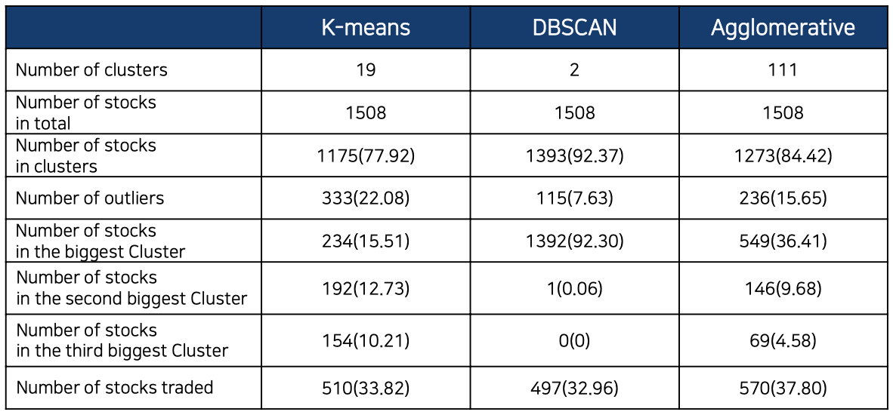
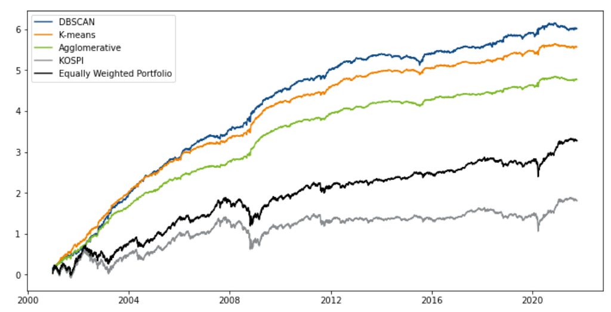
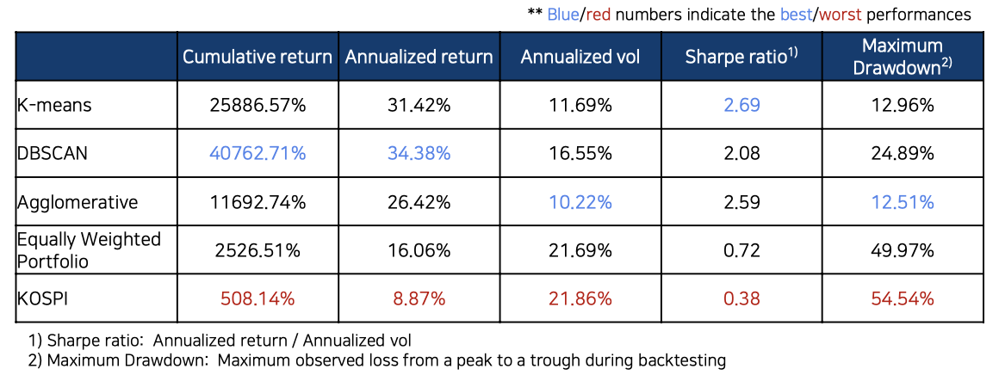

# Pair_Trading with Clsutering-Based Approach

>Objective : Utilize clustering techniques to identify pairs of correlated assets for pair trading in the Korean Financial Market. The project aims to demonstrate the effectiveness of clustering-driven pair trading using three different modles with varying price momentum indicators

## Data Sources
Closing price of all stocks existing in KOSPI/KOSDAQ market on Octover 1,2021.
* KOSPI (Max 938 stocks), KOSDAQ (Max 1517 stocks)
* Data period starts from January 2000 to September 2021, including 5128 trading days

## Technologies 
* Python 

## Code Structure 
### FrameWork

### price momentum 
* Used weekly momentum of a stock 

i-th week price momentum at the end of week t-1 is defined as, 

r_j denotes the log return in week j 

### Data Pre-processing 
*PCA 
Use standard scaler, Principal components that explains at least 99% of the total variation

### Clustering

#### Parameters
* number of clusters only for K-means Clsutering : [5,10,20,25]
* number of weekly momentum : [12,24,28]
If data is short for generating required size momentum, it is removed from the investment pool
* Percentile variable to remove outlier from the cluster : [10,20,..,90]

#### 1. K-means Clustering 
* Outlier
> Sort the distances to the nearest neighbor, and choose the distance at a percentile as the threshold
> Any stock whose distance to its centroid is greater than threshold is regarded as outlier

#### 2. DBSCAN
* MinPts : natural logarithm of the total number of data points 
* Maximum distance e : a percentile of the average distances to the nearest MinPts neighbor points
* Outlier : neighbor points in distance e < MinPts

#### 3. Agglomerative Clustering 
Assign all data points into individual cluster, merge every clusters until their nearest cluster is closer then e
* Outlier : if there is no single cluster that is in distance e

### Portfolio Formation 
1. For each cluster, sort asset by momentum
2. In each cluter, pair two stocks that has highest mom and lowest mom
3. Repeat until pairing every asset is done
4. If there is only one stock in cluster or the last stock in cluster has odd number-> remove
5. let 's' be standard deviation of pairs momentum differences
6. Pair that has larger momentum differences than 's'

## Backtesting Results

### Clustering Characteristics

### Portfolio performance : Cumulative Log-returns

Clustering-driven pair trading strategies show stable growth of cumulative log-returns without any large loss(drops) due to the market crashes

Benchmakrs (KOSPI, Equally Weighted Portfolio) show lower return performance with many sudden drops

### Portfolio performance : Risk Measures

Clustering-driven pair trading PF is superior in all risk measures compared with benchmarks

## Conclusion
> Usefulness of CLUSTERING-DRIVEN Pair Trading

Since pair trading is market-neutral trading strategy, it does not fall significantly even in the crisis and shows a different return movement from the market
Superior performance not only in terms of risk management indicators but also in terms of returns

## Future Research Direction
* Consisting portfolio with other financial assets such as ETF, commodity, etc., or more
* Using company characteristics or industry groups as an input feature of clustering methods 

## References 
*Chahn, 2018. Barclayhedge survey: Majority of hedge fund pros use AI/machine learning in investment strategies. Technical Note .
*Krauss, C., 2017. Statistical arbitrage pair trading strategies: Review and outlook. Journal of Economic Surveys 31, 513–545.
*Engle, R.F., Granger, C.W., 1987. Co-integration and error correction: representation, estimation, and testing. Econometrica , 251-276.
*Vidyamurthy, Ganapathy. Pair Trading: quantitative methods and analysis. Vol. 217. John Wiley & Sons, 2004.
*Gatev, Evan, William N. Goetzmann, and K. Geert Rouwenhorst. "Pair trading: Performance of a relative-value arbitrage
rule." The Review of Financial Studies 19.3 (2006): 797-827.
*Elliott, Robert J., John Van Der Hoek*, and William P. Malcolm. "Pair trading." Quantitative Finance 5.3 (2005): 271-
276.
*Krauss, C., Do, X.A., Huck, N., 2017. Deep neural networks, gradient-boosted trees, random forests: Statistical
arbitrage on the S&P 500. European Journal of Operational Research 259, 689–702.
*He, Z., Han, C., & Toh, A. J. W. (2021). Pair Trading via Unsupervised Learning. Available at SSRN 3835692.
*Sarmento, S.M., Horta, N., 2020. Enhancing a pair trading strategy with the application of machine learning. Expert
Systems with Applications 158, 113490.
*Aggarwal, C.C., Hinneburg, A., Keim, D.A., 2001. On the surprising behavior of distance metrics in high dimensional
space, in: International conference on database theory, Springer. pp. 420–434.
